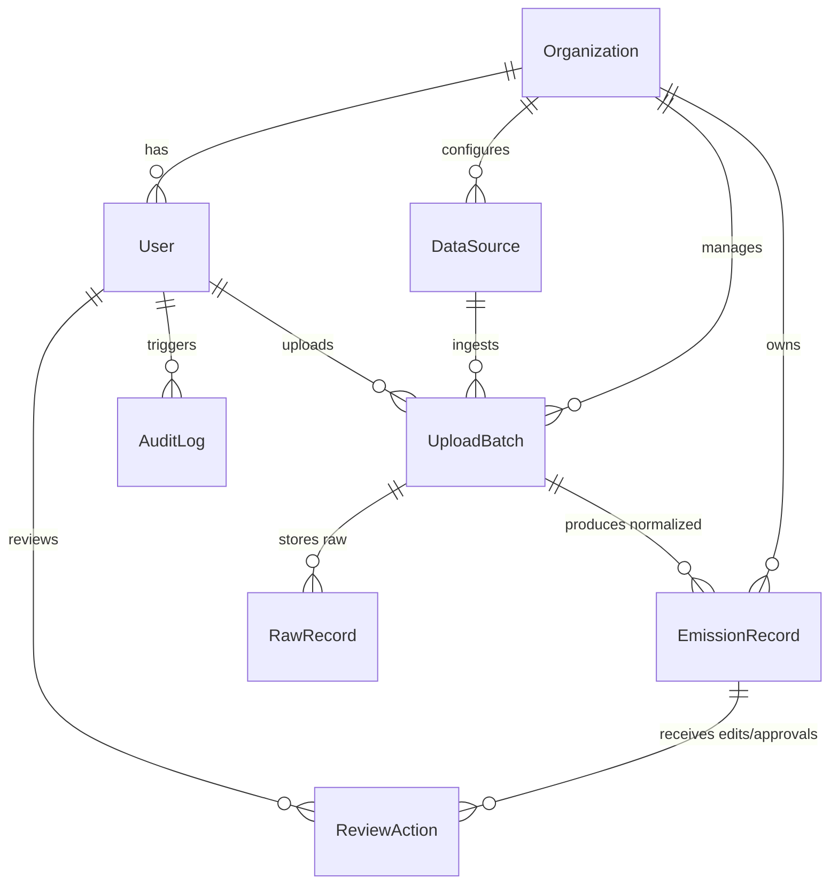

# Data Model & Architecture Documentation

This document describes the schema design, multi-tenancy model, normalization workflow, and auditability patterns implemented in the ESG Data Ingestion and Audit Review Platform.

---

## 1. Relational Database Schema

Below is the database model representation for Django/PostgreSQL:



### Models Detail

#### 1. Organization (Tenant)
- `id` (UUID, Primary Key)
- `name` (String, e.g. "Acme Corp")
- `industry` (String, e.g. "Manufacturing")
- `created_at` (DateTime)

#### 2. User
- Extends standard Django AbstractUser.
- `organization` (ForeignKey to Organization)
- `role` (String Choices: `ADMIN`, `ANALYST`, `CLIENT_USER`)

#### 3. DataSource
- `id` (UUID, Primary Key)
- `organization` (ForeignKey to Organization)
- `name` (String, e.g. "SAP Germany Procurement")
- `source_type` (String Choices: `SAP`, `UTILITY`, `TRAVEL`)
- `configuration` (JSONField: mapping configs, specific plant codes, default parameters)
- `is_active` (Boolean)

#### 4. UploadBatch
- `id` (UUID, Primary Key)
- `organization` (ForeignKey to Organization)
- `source` (ForeignKey to DataSource)
- `uploaded_by` (ForeignKey to User)
- `file_name` (String)
- `upload_timestamp` (DateTime)
- `processing_status` (String Choices: `PENDING`, `PROCESSING`, `COMPLETED`, `FAILED`)
- `total_rows` (Integer)
- `processed_rows` (Integer)
- `failed_rows` (Integer)

#### 5. RawRecord
- `id` (UUID, Primary Key)
- `batch` (ForeignKey to UploadBatch)
- `row_number` (Integer)
- `raw_payload` (JSONField: stores the raw row dictionary parsed from CSV/XLSX)
- `validation_errors` (JSONField: list of error strings or schema validation warnings)
- `is_normalized` (Boolean)

#### 6. EmissionRecord (Normalized Target)
- `id` (UUID, Primary Key)
- `organization` (ForeignKey to Organization)
- `raw_record` (OneToOneField to RawRecord, optional)
- `ingestion_batch` (ForeignKey to UploadBatch)
- `source_type` (String Choices: `SAP`, `UTILITY`, `TRAVEL`)
- `scope` (Integer Choices: `1`, `2`, `3`)
- `category` (String, e.g., "Stationary Combustion", "Purchased Electricity", "Business Travel")
- `activity_type` (String, e.g., "Diesel Fueling", "Grid Electricity", "Short-haul Flight")
- `quantity` (Decimal)
- `normalized_unit` (String, e.g. "L", "kWh", "km")
- `emission_factor` (Decimal) - kg CO2e per unit
- `calculated_emissions` (Decimal) - Metric Tonnes CO2e
- `reporting_period` (String, e.g., "2026-05" or "Q2 2026")
- `source_reference` (String, e.g. Document Number or Invoice ID)
- `confidence_score` (Decimal: 0.00 to 1.00)
- `validation_warnings` (JSONField: array of tagged warning strings)
- `review_status` (String Choices: `PENDING`, `APPROVED`, `REJECTED`)
- `comment` (TextField: Analyst review remarks)

#### 7. ReviewAction (Review Log)
- `id` (UUID, Primary Key)
- `emission_record` (ForeignKey to EmissionRecord)
- `reviewer` (ForeignKey to User)
- `action_type` (String Choices: `APPROVE`, `REJECT`, `COMMENT`, `CORRECT`)
- `field_name` (String, optional: if manual value correction occurred)
- `old_value` (TextField, optional)
- `new_value` (TextField, optional)
- `timestamp` (DateTime)

#### 8. AuditLog
- `id` (UUID, Primary Key)
- `organization` (ForeignKey to Organization)
- `entity_type` (String, e.g., "USER", "DATASOURCE", "EMISSION_RECORD")
- `entity_id` (String)
- `performed_by` (ForeignKey to User, null allowed for system actions)
- `action` (String, e.g., "CREATE_USER", "DELETE_SOURCE", "BULK_APPROVE")
- `timestamp` (DateTime)
- `metadata` (JSONField)

---

## 2. Normalization Engine Flow

The pipeline ingests raw records, processes them through tenant-specific source rules, and maps them to a unified structure:

```
[Raw CSV / Excel Upload] -> [UploadBatch Created]
                                |
                                v
                   [RawRow Dict parsed & stored]
                                |
                                v
               [Normalization Pipeline executes]
                                |
          +---------------------+---------------------+
          |                     |                     |
   (Source: SAP)        (Source: Utility)     (Source: Travel)
          |                     |                     |
     [Convert Units]       [Align periods]       [Calc distances]
     [Verify Plants]       [Detect Spikes]       [Map Cabin Class]
          |                     |                     |
          +---------------------+---------------------+
                                |
                                v
             [Apply Emission Factor & Calculate CO2e]
                                |
                                v
               [Tag Warnings / Anomalies / Duplicates]
                                |
                                v
              [Generate Unified EmissionRecord]
```

## 3. Multi-Tenancy Design
Tenant isolation is enforced via organizational scoping:
- All data-bearing tables (`DataSource`, `UploadBatch`, `EmissionRecord`, `AuditLog`) contain an `organization_id` foreign key.
- Custom Django model managers enforce automatic filtering: `queryset.filter(organization=request.user.organization)`.
- Backend permission classes check `user.organization` compatibility on all read/write endpoints.
- Front-end views are fully tenant-scoped; users cannot see data belonging to other companies.
