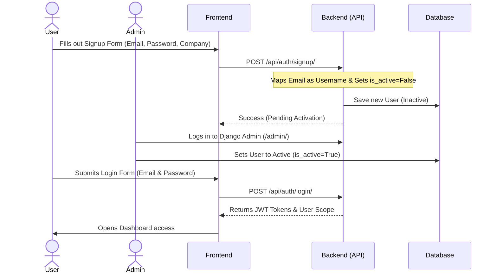

# ESG Data Ingestion, Normalization & Reporting Platform

A robust, enterprise-grade carbon accounting and ESG (Environmental, Social, and Governance) data platform. This system facilitates the automated ingestion, validation, and review of Scope 1, 2, and 3 emissions records, turning raw data from SAP systems, utility billing, and travel databases into clean, structured ESG insights.

---

## 🏗️ Architecture Overview

The project is structured into a separated Backend and Frontend architecture:

1. **Backend (`/backend`)**:
   * **Core**: Django & Django REST Framework (DRF) running Python 3.13.
   * **Database**: PostgreSQL (Neon Serverless PostgreSQL in production, SQLite for default local environments).
   * **Authentication**: JWT-based token authentication via `djangorestframework-simplejwt`.
   * **Admin UI**: Styled using `django-jazzmin` for a clean, custom dark dashboard interface.
   * **Production Serving**: Hosted via Gunicorn, using `WhiteNoise` for static asset hosting.

2. **Frontend (`/frontend`)**:
   * **Core**: React, Vite, TypeScript.
   * **Styling**: Tailored Vanilla CSS with high-end dark slate aesthetics, floating background gradients, and hover transitions.
   * **Data Visualization**: Recharts for dynamic Scope 1/2/3 charts, trends, and validation warning breakdowns.

---

## 🔐 Authentication & Project Flow

We use a **Moderated Signup and Invitation Flow** to keep organizational data secure.



### 1. User Sign Up
* Users click **Sign up** on the frontend, entering their Name, Email, Organization, and Password.
* The backend saves the user using their email address as their username (lowercased), with their status set to **Inactive** (`is_active = False`).
* They cannot log in until approved.

### 2. Admin Approval (Step-by-Step)
1. **Access the Admin Portal**: Navigate to the backend URL path ending in `/admin/` (e.g., `http://127.0.0.1:8000/admin/` locally or `https://<backend-url>/admin/` in production).
2. **Log In**: Sign in using your administrator credentials (e.g., `admin@acme.com` / `admin123`).
3. **Open Users**: Click on **Users** in the sidebar navigation (under the **Api** section).
4. **Select Inactive User**: Locate the user registration you want to approve. Inactive users will show a red indicator or cross under the **Active** column. Click on their name/email.
5. **Assign Details**:
   * Review the user's name, email, and requested company name.
   * Assign a **Role** (`Admin`, `Analyst`, or `Client User`).
   * Verify/Assign their **Organization** (the database automatically matches or creates this from the company name they typed during signup).
6. **Activate Account**: Scroll down to the **Permissions** section and check the **Active** (`is_active`) checkbox.
7. **Save**: Click the **Save** button in the bottom right corner. The user is now activated and can log in instantly.

### 3. User Login
* The activated user logs into the app using their **Email** and **Password**.
* They receive a JWT token which authorizes subsequent requests.

---

## 🔑 Seeded Login Credentials

If you have seeded the database, the following accounts are available immediately:

| Email / Username | Password | Role | Access Level |
| :--- | :--- | :--- | :--- |
| **`admin@acme.com`** | `admin123` | **ADMIN** | Full dashboard, data manipulation, database admin panel (`/admin/`). |
| **`analyst@acme.com`** | `analyst123` | **ANALYST** | Quality control, reviews raw records, approves/rejects emission inputs. |
| **`client@acme.com`** | `client123` | **CLIENT_USER** | Data Uploader, configures sources, uploads raw files (SAP/Utility/Travel). |

---

## 🚀 Running the Project Locally

### 1. Running the Backend
Navigate to the `/backend` folder:
```bash
cd backend
```

Create and activate a Python virtual environment:
```bash
# Windows
python -m venv venv
venv\Scripts\activate

# macOS / Linux
python3 -m venv venv
source venv/bin/activate
```

Install the dependencies:
```bash
pip install -r requirements.txt
```

Prepare the database (Migrations & Seeding):
```bash
python manage.py migrate
python seed.py
```

Run the development server:
```bash
python manage.py runserver
```
The API will be available at `http://127.0.0.1:8000/`. You can access the styled database admin panel at `http://127.0.0.1:8000/admin/`.

---

### 2. Running the Frontend
Navigate to the `/frontend` folder:
```bash
cd frontend
```

Install Node.js packages:
```bash
npm install
```

Configure your local environment variables. Create a `.env` file in `/frontend`:
```env
VITE_API_URL=http://127.0.0.1:8000/api
```

Start the Vite development server:
```bash
npm run dev
```
The React frontend will be available at `http://localhost:5173/`.

---

### 🐳 Running via Docker Compose
If you prefer to run both services together using Docker:
From the root directory containing `docker-compose.yml`, run:
```bash
docker-compose up --build
```
This starts both the backend (on port `8000`) and the frontend (on port `5173`) with the Postgres database fully managed.
