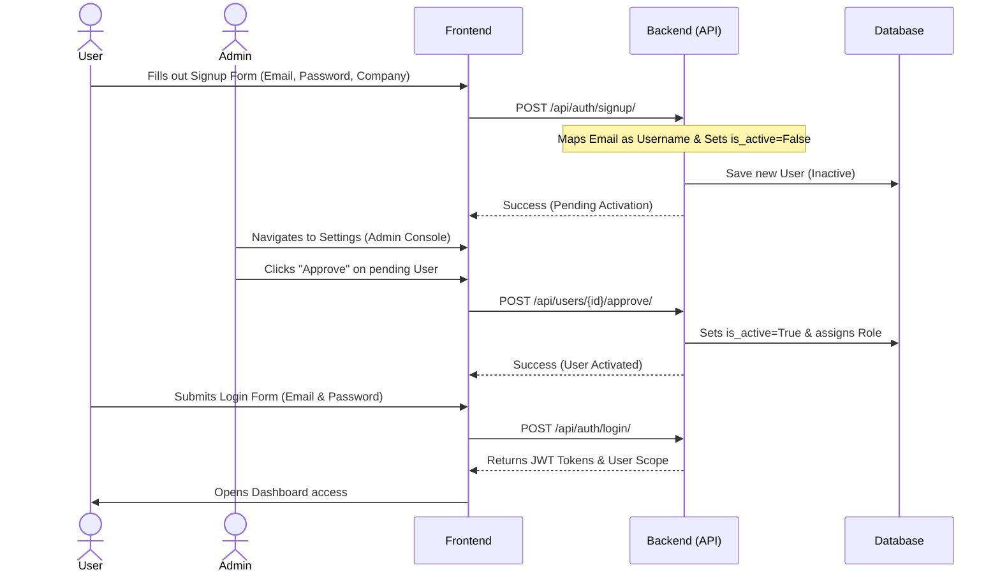

# ESG Data Ingestion, Normalization & Reporting Platform

A robust, enterprise-grade carbon accounting and ESG (Environmental, Social, and Governance) data platform. This system facilitates the automated ingestion, validation, and review of Scope 1, 2, and 3 emissions records, turning raw data from SAP systems, utility billing, and travel databases into clean, structured ESG insights.

---

## 🏗️ Architecture Overview

The project is structured into a separated Backend and Frontend architecture:

1. **Backend (`/backend`)**:
   * **Core**: Django & Django REST Framework (DRF) running Python 3.13.
   * **Database**: PostgreSQL (Neon Serverless PostgreSQL in production, SQLite for default local environments).
   * **Authentication**: JWT-based token authentication via `djangorestframework-simplejwt`.
   * **Admin UI**: Styled using `django-jazzmin` for a clean, custom dark dashboard interface.
   * **Production Serving**: Hosted via Gunicorn, using `WhiteNoise` for static asset hosting.

2. **Frontend (`/frontend`)**:
   * **Core**: React, Vite, TypeScript.
   * **Styling**: Tailored Vanilla CSS with high-end dark slate aesthetics, floating background gradients, and hover transitions.
   * **Data Visualization**: Recharts for dynamic Scope 1/2/3 charts, trends, and validation warning breakdowns.

---

## 🔐 Authentication & Project Flow

We use a **Moderated Signup and Invitation Flow** to keep organizational data secure.



### 1. User Sign Up
* Users click **Sign up** on the frontend, entering their Name, Email, Organization, and Password.
* The backend saves the user using their email address as their username (lowercased), with their status set to **Inactive** (`is_active = False`).
* They cannot log in until approved.

### 2. Admin Approval (Step-by-Step)
You can approve users directly inside the application frontend:
1. **Log In as Admin**: Sign in using your administrator credentials (e.g., `admin@acme.com` / `admin123`) on the frontend login page.
2. **Open Settings**: Click on **Settings** in the sidebar. This opens the **Admin Management Console**.
3. **Approve User**: Under **User Directory & Approvals**, locate the pending signup (highlighted with a "Pending Approval" tag). Click the green **Approve** button to activate them instantly.
4. **Adjust Role**: Use the inline dropdown select menu to assign/change their permission level (`Client User`, `Analyst`, or `Admin`).
5. *(Optional Database Alternative)*: If needed, raw database records can still be managed in the Django Admin Portal at `/admin/`.

### 3. User Login
* The activated user logs into the app using their **Email** and **Password**.
* They receive a JWT token which authorizes subsequent requests.

---

## 🔑 Seeded Login Credentials

If you have seeded the database, the following accounts are available immediately:

| Email / Username | Password | Role | Access Level |
| :--- | :--- | :--- | :--- |
| **`admin@acme.com`** | `admin123` | **ADMIN** | Full dashboard, data manipulation, database admin panel (`/admin/`). |
| **`analyst@acme.com`** | `analyst123` | **ANALYST** | Quality control, reviews raw records, approves/rejects emission inputs. |
| **`client@acme.com`** | `client123` | **CLIENT_USER** | Data Uploader, configures sources, uploads raw files (SAP/Utility/Travel). |

---

## 🚀 Running the Project Locally

### 1. Running the Backend
Navigate to the `/backend` folder:
```bash
cd backend
```

Create and activate a Python virtual environment:
```bash
# Windows
python -m venv venv
venv\Scripts\activate

# macOS / Linux
python3 -m venv venv
source venv/bin/activate
```

Install the dependencies:
```bash
pip install -r requirements.txt
```

Prepare the database (Migrations & Seeding):
```bash
python manage.py migrate
python seed.py
```

Run the development server:
```bash
python manage.py runserver
```
The API will be available at `http://127.0.0.1:8000/`. You can access the styled database admin panel at `http://127.0.0.1:8000/admin/`.

---

### 2. Running the Frontend
Navigate to the `/frontend` folder:
```bash
cd frontend
```

Install Node.js packages:
```bash
npm install
```

Configure your local environment variables. Create a `.env` file in `/frontend`:
```env
VITE_API_URL=http://127.0.0.1:8000/api
```

Start the Vite development server:
```bash
npm run dev
```
The React frontend will be available at `http://localhost:5173/`.

---

### 🐳 Running via Docker Compose
If you prefer to run both services together using Docker:
From the root directory containing `docker-compose.yml`, run:
```bash
docker-compose up --build
```
This starts both the backend (on port `8000`) and the frontend (on port `5173`) with the Postgres database fully managed.

---

## 🖥️ Live Hosted Platform Guide (How to Use)

Once logged in, different roles can perform actions in the interface to test or manage the platform. Below are step-by-step flows for testing the hosted system:

### 📊 1. View Reporting Dashboard (All Roles)
* **Access**: Log in with any of the seeded credentials.
* **Flow**:
  * View dynamic summary metrics at the top: **Scope 1** (direct combustion), **Scope 2** (purchased grid electricity), and **Scope 3** (corporate travel).
  * Hover over the interactive **Scope Emissions Breakdown** (pie chart) and **Monthly Emissions Trend** (bar/line chart) to inspect detailed carbon numbers.
  * Check **Ingestion Summary** counters representing active data sources and processing logs.

### 🔌 2. Configure Ingestion Sources (Client / Admin)
* **Access**: Log in as `client@acme.com` (or `admin@acme.com`) and navigate to **Data Sources**.
* **Flow**:
  * View the list of active source configurations (e.g. *SAP ERP Procurement*, *Grid Utility Billing*).
  * Toggle sources to active/inactive, or configure new ingestion rulesets.

### 📤 3. Ingest Data via File Upload (Client / Admin)
* **Access**: Log in as `client@acme.com` and navigate to **Upload Data**.
* **Flow**:
  * Select your data source (e.g., *SAP ERP Procurement*).
  * Upload a CSV or Excel data file.
  * **Preview Mode**: The app will display a clean preview of your file data in the browser.
  * Click **Process File**: The backend reads the contents, runs normalization routines, checks validation settings, and updates the processing batch logs status to `COMPLETED`.

### 🔍 4. Review & Validate Raw Emissions (Analyst / Admin)
* **Access**: Log in as `analyst@acme.com` and navigate to **Review Queue**.
* **Flow**:
  * View the list of ingested records pending verification. Highlighted alerts flag validation warnings (e.g. *unknown plant codes* or *suspicious consumption spikes*).
  * **Detail View**: Click any row to expand a detail panel showing raw JSON payloads and error messages.
  * **Verify and Correct**:
    * Edit values inline (e.g. manually correcting a fuel quantity or unit).
    * Leave comments in the feedback thread.
    * Click **Approve** or **Reject**. Approved records are immediately updated on the main reporting dashboard charts!

### 📜 5. Inspect Audit Log (Admin)
* **Access**: Log in as `admin@acme.com` and navigate to **Audit Log**.
* **Flow**:
  * Inspect the secure system log tracking all user actions (e.g. uploads, manual corrections, status changes). Each log details who performed the action, which organization they belong to, and the timestamp.

### ⚙️ 6. Manage Platform & Approvals in Django Admin (Admin Only)
* **Access**: Log in as `admin@acme.com` / `admin123` at the backend URL's `/admin/` path (e.g., `https://<your-hosted-backend-url>/admin/` or `http://127.0.0.1:8000/admin/`).
* **Flow**:
  * **Approve Pending Accounts**: Go to **Users**, click an inactive pending registration (indicated by a red cross), verify their details, assign their **Role** and **Organization**, check **Active**, and click **Save**.
  * **Manage Tenants**: Go to **Organizations** to view, create, or update enterprise client companies.
  * **Raw Data Audits**: Directly inspect, query, or manage raw ingested records under **Data Sources**, **Upload Batches**, **Raw Records**, and **Emission Records** tables.


